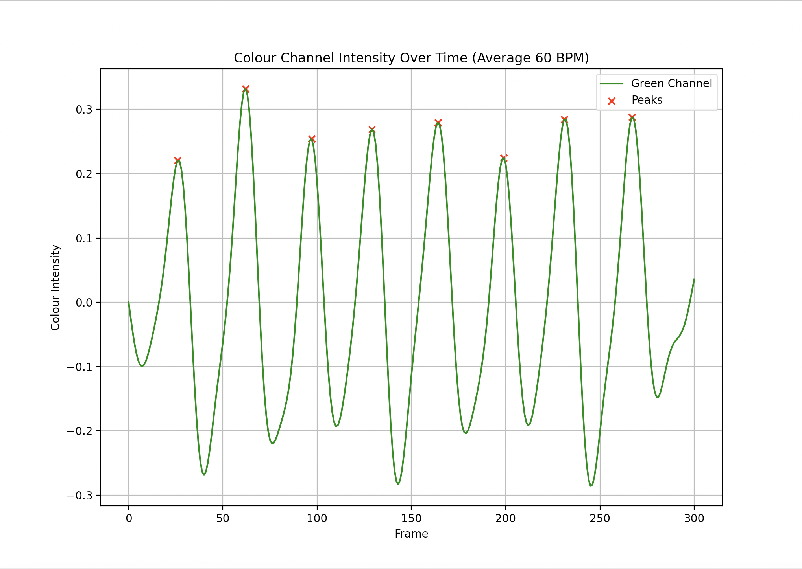

 
  <h2 align="center">Live Heart Rate Sensor (WIP)</h2>

## About The Project

Eulerian Video Magnification is a series of algorithms used to amplify subtle changes in a video (positional, colour) to show movements originally invisible to the human eye. I've always had a passion for health technology so I wanted to apply this algorithm to detect human heart rate from a simple video taken from a cell phone, completely contactless. 

## Photos
This project is currently a work in progress to better implement Eulerian Video Magnification, however, in its current state it can still detect heart rate from a video. The following graph below uses `face.mp4` and plots the change in colour intensity.

This is currently the most accurate method from this project, a live implementation is also being implemented.

## References

* Thanks to MIT CSAIL for an in-depth research paper on [Eulerian Video Magnification](https://people.csail.mit.edu/mrub/papers/vidmag.pdf)
* Thanks to Steve Mould for the [YouTube Video](https://youtu.be/BFZxlauizx0?si=LPWsUPZ-Byx51Ze3) that inspired this project