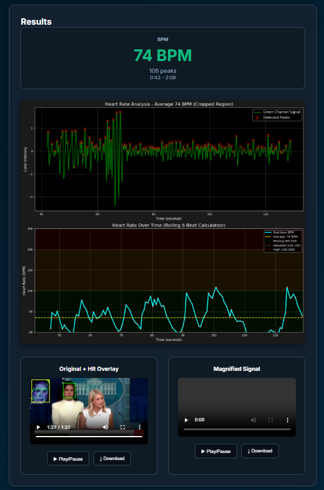

# Heart-Rate Analyzer 🫀📈



Contact-less heart-rate detection from any YouTube video using Eulerian Video Magnification (EVM).  Paste a link, pick a range & face region, and the app returns:

* Average BPM + rolling 6-beat graph
* Magnified-signal video
* Original video with live HR overlay

---

## 🌟 Features

* Highest-quality YouTube download (720p fallback)
* Custom time-range selection
* Drag-and-drop crop box with optional dynamic tracking (CSRT/KCF/MIL)
* Real-time progress bar & step indicators
* Dark-mode, responsive UI
* Downloadable overlay & EVM videos (MP4, H.264 + AAC)

---

## 🚀 Quick Start

```bash
# 1.  Clone & install
$ git clone https://github.com/your-user/HR-Analyzer.git
$ cd HR-Analyzer
$ python -m venv venv && source venv/bin/activate   # (Windows: venv\Scripts\activate)
$ pip install -r requirements.txt

# 2.  Run
$ python app.py
```
Browse to `http://localhost:5000`.

---

## 🖐️  How to Use

1. **Find a suitable video** – 1–4 minutes long, with a _single face or exposed skin that stays mostly in view_ (minimal scene cuts).  Copy the YouTube URL.
2. **Paste the link** and tick **Custom Time Range**. Enter start/end in `mm:ss` (or plain digits like `0042`).
3. **Load Preview** – when the first frame appears, _drag_ a rectangle around the face / skin region. (Leave full-frame if unsure.)
4. Click **Confirm Selection & Analyze**.  Grab a coffee ☕ – progress updates live.
5. Review results: BPM stats, graphs, and playable / downloadable videos.

> 🔎  Tip: tracking works best with CSRT (requires `opencv-contrib-python`).  Un-check **Dynamic Region Tracking** if footage is very shaky.

---

## 🛠️  Troubleshooting

| Issue | Fix |
|-------|-----|
| "No tracker available" | Ensure `opencv-contrib-python` ≥ 4.8 installed |
| Grey videos / 0:00 duration | FFmpeg missing – install system ffmpeg or add to PATH |
| Wrong time-range | Use `mm:ss` or `0042` format; field auto-formats on blur |

---

## 📜 License

MIT © 2025 Your Name